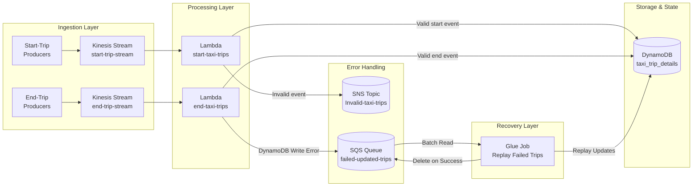
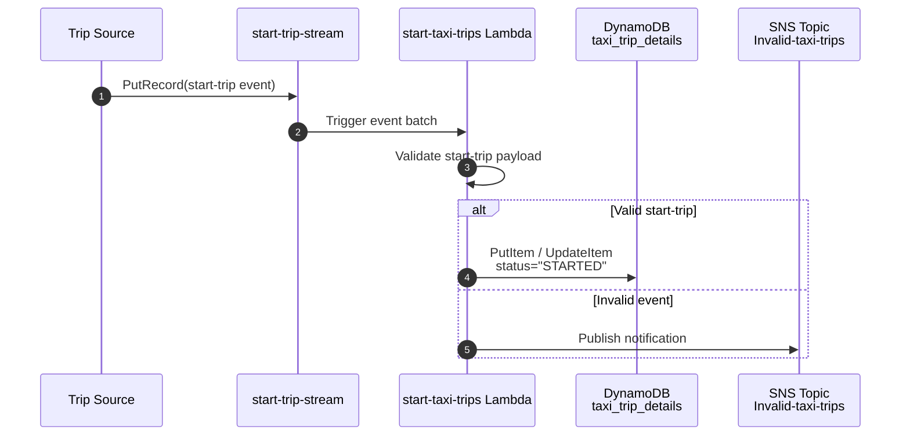
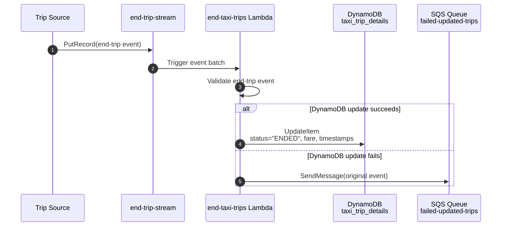
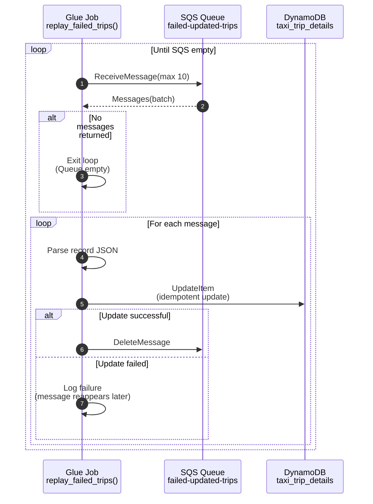

# 🚕 Taxi Trips Streaming - AWS Architecture

This project provides a **fault‑tolerant, real-time streaming pipeline** for taxi trip events. (modify there to discribe the major goal of this project) Built on AWS, it uses Kinesis + Lambda for event processing, DynamoDB for state storage, and SNS/SQS/Glue for error handling and recovery.

---

See [ROADMAP](ROADMAP.md) for upcoming improvements.

# Table of Contents

- [Tech Stack With AWS](#tech-stack-wiith-aws)
- [Architecture Overview](#architecture-overview)
- [Components](#components)
- [Data Source](#data-source)
- [Data Flow Summary](#data-flow-summary)
- [Sequence Diagrams](#sequence-diagrams)
  - [Start-Trip Event Flow](#1️⃣-start-trip-event-flow)
  - [End-Trip Event Flow](#2️⃣-end-trip-event-flow)
  - [Glue Replay Recovery Flow](#3️⃣-glue-replay-recovery-flow)

---

# Tech Stack With AWS
- **Kinesis** – real-time ingestion of taxi start/end events
- **Lambda** – serverless compute for validating and upserting trips  
- **DynamoDB** – low-latency store for taxi trip details 
- **SNS** – notifications for invalid taxi trips 
- **SQS** – buffer for failed updates (replay queue) 
- **Glue** – batch replay of failed events from SQS 
- **IAM** - resource permission control 
- **CloudFormation** - keep the environment reproducible via IaC

---

# Architecture Overview



---

# Components

### **1. Amazon Kinesis Streams**
Two dedicated streams:
- `start-trip-stream`
- `end-trip-stream`

Consume start-trip and end-trip events independently.

### **2. AWS Lambda Functions**

#### `start-taxi-trips`
- Validates start-trip events  
- Writes initial trip record to DynamoDB  
- Sends invalid events to SNS  

#### `end-taxi-trips`
- Processes end-trip events  
- Updates DynamoDB with completion details  
- On error → sends event to SQS (`failed-updated-trips`)

### **3. Amazon DynamoDB**
Persist trip states and attributes in the table `taxi_trip_details` (trip_id as PK), providing low-latency reads and writes for real-time trip updates.

### **4. Amazon SQS**
The `failed-updated-trips` queue stores events that the end-trip Lambda could not write to DynamoDB.

This ensures recovery if an event update fails.

### **5. Amazon SNS**
All malformed or inconsistent start-trip events are published to the SNS topic: `invalid-taxi-trips`.

An email subscription receives alerts for inspection.

### **6. AWS Glue Job**
A Python job that batch-processes SQS failures, reapplies DynamoDB updates, and deletes SQS messages only after a successful replay.

Test this connection.

---

# Data Source

San Francisco’s open taxi trip dataset is used as the project’s data source,  modeled as a continuous stream of start‑trip and end‑trip events to simulate real‑time taxi operations. [Here describes attributes of taxi trip events](data/taxi-trip-event-attributes.md).

---

# Data Flow Summary

```
Start-trip → Kinesis → Lambda → DynamoDB
End-trip   → Kinesis → Lambda → DynamoDB (✓ success)
End-trip   → Kinesis → Lambda → SQS (✗ failure)
SQS → Glue Replay → DynamoDB (recovered)
```

---

# Sequence Diagrams

---

## 1️⃣ Start-Trip Event Flow




## 2️⃣ End-Trip Event Flow



## 3️⃣ Glue Replay Recovery Flow

