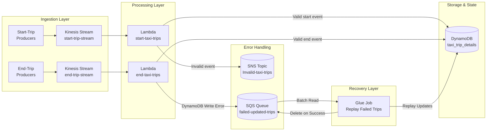
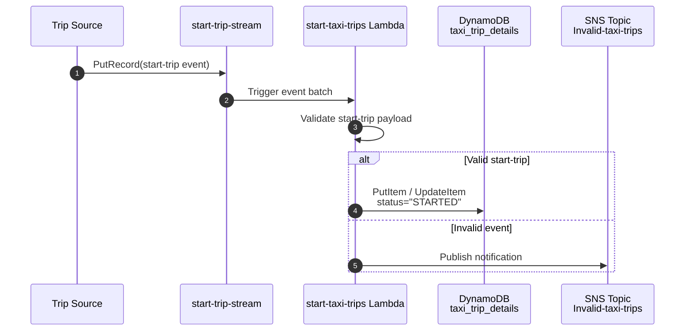
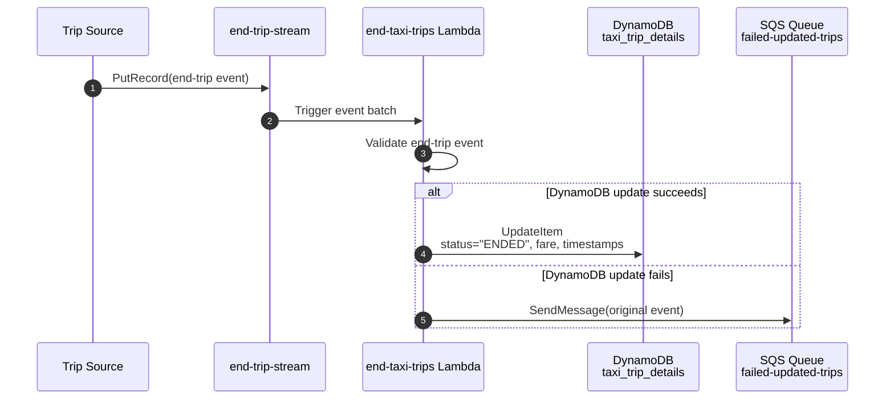
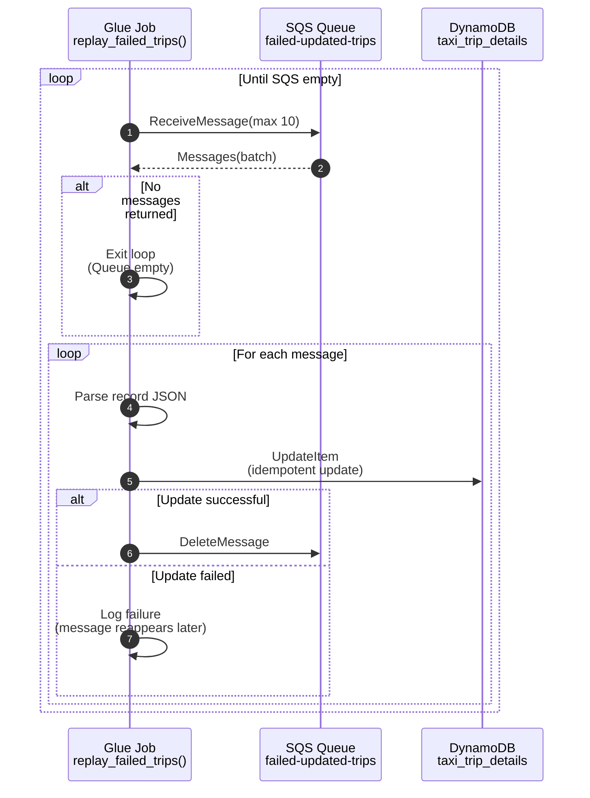

# 🚕 Taxi Trip Streaming Pipeline

This project provides a **fault‑tolerant, real‑time streaming pipeline** for taxi trip events. Built on **AWS**, it uses Kinesis + Lambda for event processing, DynamoDB for state storage, and SNS/SQS/Glue for error handling and recovery.

---

# Table of Contents

- [Tech Stack](#tech-stack)
- [High-Level Architecture](#high-level-architecture)
- [Components](#components)
- [Data Source](#data-source)
- [Data Flow Summary](#data-flow-summary)
- [Sequence Diagrams](#sequence-diagrams)
  - [Start-Trip Event Flow](#1️⃣-start-trip-event-flow)
  - [End-Trip Event Flow](#2️⃣-end-trip-event-flow)
  - [Glue Replay Recovery Flow](#3️⃣-glue-replay-recovery-flow)

---

# Tech Stack
- **AWS Kinesis** – real-time ingestion of taxi start/end events
- **AWS Lambda** – serverless compute for validating and upserting trips  
- **Amazon DynamoDB** – low-latency store for taxi trip details 
- **Amazon SQS** – buffer for failed updates (replay queue) 
- **AWS Glue** – batch replay of failed events from SQS 
- **Amazon SNS** – notifications for invalid taxi trips 
- **Amazon S3** – landing bucket for sample data & artifacts 
- **AWS IAM** - resource access control 
- **AWS CloudFormation** - keep the environment reproducible via IaC

---

# High-Level Architecture



---

# Data Source
This project uses sampled records from San Francisco taxi trip datasets, published through the city’s open data platform. The dataset is modeled as a continuous stream of start‑trip and end‑trip events to simulate real‑time taxi operations.

### Taxi Trip Event Attributes

| **Start‑Trip Attribute**       | **Description**                  | **End‑Trip Attribute**       | **Description**                  |
|--------------------------------|------------------------------------------------|------------------------------|------------------------------------------------|
| `trip_id`                      | Unique identifier for the trip                 | `trip_id`                    | Unique identifier for the trip                 |
| `start_time_local`             | Local timestamp when the trip started          | `end_time_local`             | Local timestamp when the trip ended            |
| `vehicle_placard_number`       | Taxi vehicle placard number                    | `fare_type`                  | Type of fare applied                           |
| `driver_id`                    | Identifier for the driver                      | `meter_fare_amount`          | Fare amount from meter                         |
| `pickup_location_latitude`     | Latitude of pickup location                    | `promo_rate`                 | Promotional rate applied                       |
| `pickup_location_longitude`    | Longitude of pickup location                   | `tolls`                      | Toll charges                                   |
| `dropoff_location_latitude`    | Latitude of intended dropoff location          | `sf_exit_fee`                | San Francisco exit fee                         |
| `dropoff_location_longitude`   | Longitude of intended dropoff location         | `other_fees`                 | Additional fees                                |
| `hail_type`                    | Type of hail (street, app, etc.)               | `tip`                        | Tip amount                                     |
| `upfront_pricing`              | Pricing information provided upfront           | `extra_amount`               | Extra charges (e.g., surcharges)               |
|                                |                                                | `total_fare_amount`          | Total fare amount                              |
|                                |                                                | `fare_time_milliseconds`     | Duration of fare in milliseconds               |
|                                |                                                | `trip_distance_meters`       | Distance traveled in meters                    |
|                                |                                                | `qa_flags`                   | Quality assurance flags                        |
|                                |                                                | `paratransit`                | Indicates paratransit service                  |

---

# Components

### **1. Amazon Kinesis Streams**
Two dedicated streams:
- `start-trip-stream`
- `end-trip-stream`

Consume start-trip and end-trip events independently.

### **2. AWS Lambda Functions**

#### **start-taxi-trips**
- Validates start-trip events  
- Writes initial trip record to DynamoDB  
- Sends invalid events to SNS  

#### **end-taxi-trips**
- Processes end-trip events  
- Updates DynamoDB with completion details  
- On error → sends event to SQS (`failed-updated-trips`)

### **3. DynamoDB — `taxi_trip_details`**
Persist trip states and attributes (trip_id as PK).

### **4. SQS — Failed Update Buffer**
`failed-updated-trips` queue stores events that the end-trip Lambda could not write to DynamoDB.

This ensures no event is ever lost.

### **5. AWS SNS — Invalid Data Notifications**
All malformed or inconsistent start-trip events are published to:
```
SNS Topic: Invalid-taxi-trips
```
An email subscription receives alerts for inspection.

### **6. AWS Glue Replay Job**
A Python job performing:

Batch-process SQS failures, reapply DynamoDB updates, delete SQS messages only after successful replay.

---

# Data Flow Summary

```
Start-trip → Kinesis → Lambda → DynamoDB
End-trip   → Kinesis → Lambda → DynamoDB (✓ success)
End-trip   → Kinesis → Lambda → SQS (✗ failure)
SQS → Glue Replay → DynamoDB (recovered)
```

---

# Sequence Diagrams

---

## 1️⃣ Start-Trip Event Flow




## 2️⃣ End-Trip Event Flow



## 3️⃣ Glue Replay Recovery Flow

