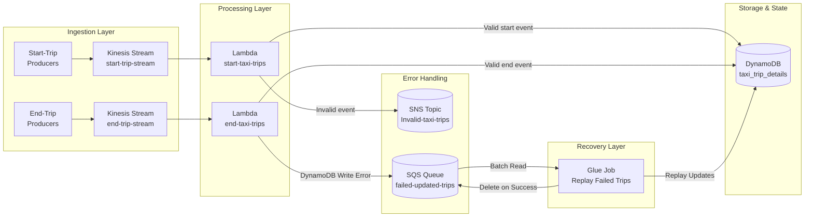
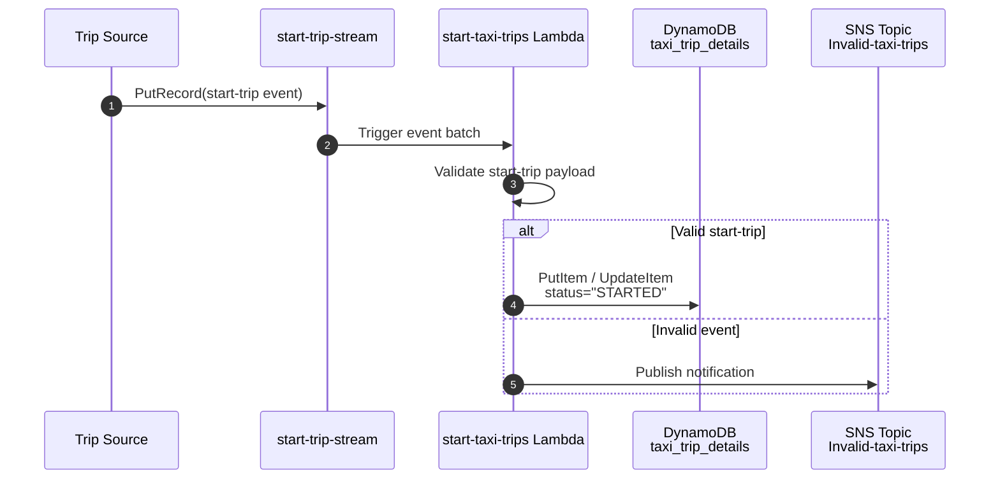
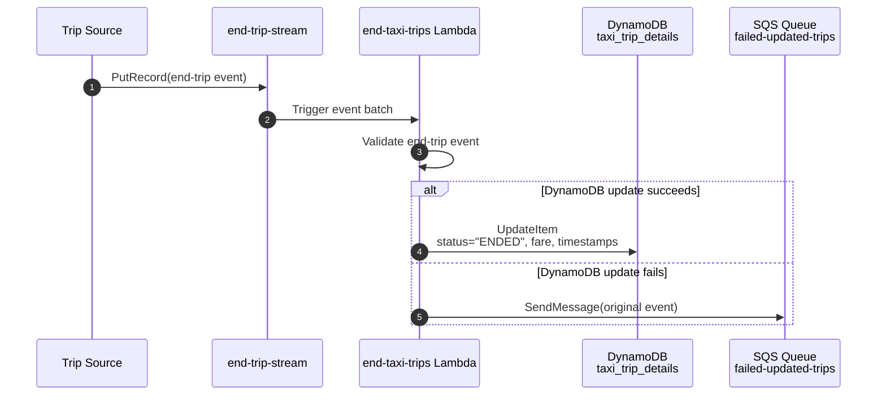
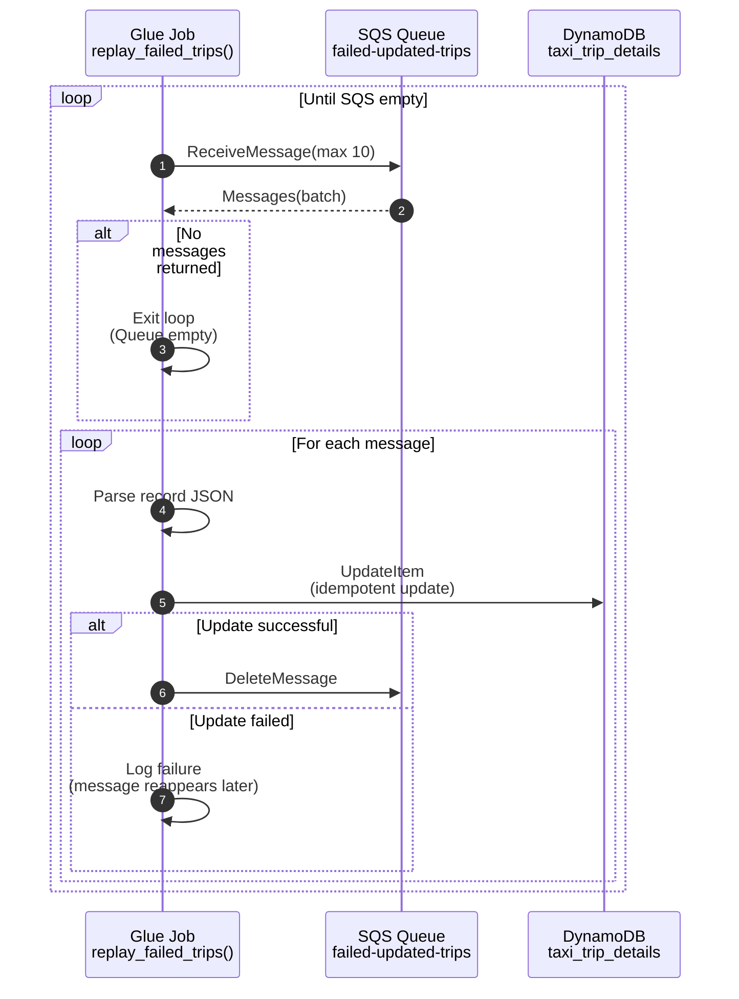

# 🚕 Taxi Trip Streaming Pipeline

This project provides a **fault‑tolerant, real‑time streaming pipeline** for taxi trip events.  
Built on **AWS**, it uses Kinesis + Lambda for event processing, DynamoDB for state storage, and SNS/SQS/Glue for error handling and recovery.

---

# Table of Contents

- [Features](#features)
- [Tech Stack](#tech-stack)
- [High-Level Architecture](#high-level-architecture)
- [Components](#components)
- [Data Flow Summary](#data-flow-summary)
- [Sequence Diagrams](#sequence-diagrams)
  - [Start-Trip Event Flow](#1️⃣-start-trip-event-flow)
  - [End-Trip Event Flow](#2️⃣-end-trip-event-flow)
  - [Glue Replay Recovery Flow](#3️⃣-glue-replay-recovery-flow)


# Features
- Real‑time ingestion of taxi trip events  
- Serverless processing with AWS Lambda  
- Reliable state management in DynamoDB  
- Robust error handling and recovery  

---

# Tech Stack
- **AWS Kinesis** – event streaming  
- **AWS Lambda** – serverless compute  
- **Amazon DynamoDB** – state storage  
- **Amazon SNS & SQS** – messaging and error handling  
- **AWS Glue** – data recovery and ETL  

---

# High-Level Architecture



---

# Components

### **1. Amazon Kinesis Streams**
Two dedicated streams:
- `start-trip-stream`
- `end-trip-stream`

These provide high-throughput ingestion and ordered delivery.

---

### **2. AWS Lambda Functions**

#### **start-taxi-trips**
- Validates start-trip events  
- Writes initial trip record to DynamoDB  
- Sends invalid events to SNS  

#### **end-taxi-trips**
- Processes end-trip events  
- Updates DynamoDB with completion details  
- On error → sends event to SQS (`failed-updated-trips`)

---

### **3. DynamoDB — `taxi_trip_details`**
Stores the authoritative record of every trip:

---

### **4. SQS — Failed Update Buffer**
`failed-updated-trips` queue stores events that the end-trip Lambda could not write to DynamoDB.

This ensures *no event is ever lost*.

---

### **5. AWS SNS — Invalid Data Notifications**
All malformed or inconsistent start-trip events are published to:
```
SNS Topic: Invalid-taxi-trips
```
An email subscription receives alerts for inspection.

---

### **6. AWS Glue Replay Job**
A Python job performing:

- Batch SQS reads  
- Idempotent DynamoDB updates  
- Guaranteed deletion of SQS messages only after success  

---

# Data Flow Summary

```
Start-trip → Kinesis → Lambda → DynamoDB
End-trip   → Kinesis → Lambda → DynamoDB (✓ success)
End-trip   → Kinesis → Lambda → SQS (✗ failure)
SQS → Glue Replay → DynamoDB (recovered)
```

This ensures:

- No data loss  
- Automatic recovery  
- Reliable end-to-end consistency  

---

# Sequence Diagrams

---

## 1️⃣ Start-Trip Event Flow



---

## 2️⃣ End-Trip Event Flow



---

## 3️⃣ Glue Replay Recovery Flow



---